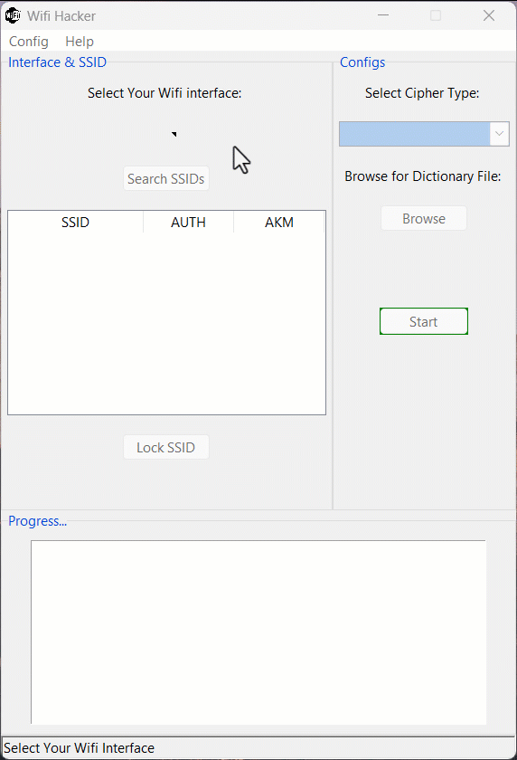

# WiFi Hacker Application Guide

This comprehensive guide will walk you through the features and usage of the WiFi Hacker application, a tool designed for educational and security testing purposes.

**Disclaimer:** Unauthorized access to WiFi networks is illegal and unethical. This application should only be used on networks you own or have explicit permission to test.

## Overview

The WiFi Hacker application is a graphical user interface (GUI) tool built using Python and the Tkinter library. It allows users to scan for available WiFi networks, select a target network, and attempt to crack its password using a dictionary attack method. The application utilizes the PyWiFi library to interact with wireless network interfaces.

## Main Features

- WiFi Interface Selection: Choose the wireless network adapter to use for scanning and attacks.
- SSID Scanning: Search for available WiFi networks in range.
- Target Network Selection: Select a specific network to attack from the list of discovered SSIDs.
- Cipher Type Configuration: Choose between TKIP and CCMP encryption methods.
- Dictionary File Selection: Browse and select a wordlist file for the password cracking attempt.
- Attack Execution: Initiate the dictionary attack on the selected network.
- Progress Monitoring: View real-time progress and status updates during the attack.

## User Interface Layout

The application window is divided into several sections:

- Interface & SSID Frame: Contains controls for selecting the WiFi interface, scanning for SSIDs, and locking onto a target network.
- Configs Frame: Includes options for selecting the cipher type and browsing for the dictionary file.
- Output Frame: Displays progress and status messages during the attack.
- Status Bar: Shows the current state of the application and provides user guidance.

## Step-by-Step Usage Guide

### 1. Launching the Application

To start the WiFi Hacker application, run the `wifi-hack.exe` file. This will open the main application window.

### 2. Selecting a WiFi Interface

1. Click on the dropdown menu labeled "Select Your Wifi interface".
2. Choose one of the available WiFi adapters from the list.
3. Once selected, the "Search SSIDs" button will become active.

### 3. Scanning for WiFi Networks

1. Click the "Search SSIDs" button.
2. The status bar will indicate that the search is in progress, which can take up to 10 seconds.
3. Once complete, a list of discovered networks will appear in the SSID table.

### 4. Selecting a Target Network

1. Click on a network in the SSID table to select it.
2. The "Lock SSID Selected" button will become active.
3. Click "Lock SSID Selected" to confirm your target network.

### 5. Configuring Attack Parameters

1. Cipher Type: Select either "TKIP" or "CCMP (preferred)" from the dropdown menu.
2. Dictionary File: Click the "Browse" button to select a text file containing potential passwords.

### 6. Initiating the Attack

1. The "Start" button will become active (colored green).
2. Click "Start" to begin the dictionary attack.

### 7. Monitoring Progress

- The Output Frame will display real-time progress, showing each password attempt.
- The Status Bar will indicate that the attack is in progress.

### 8. Attack Completion

The attack will continue until either:
- A successful password is found, which will be displayed in the Output Frame.
- All passwords in the dictionary file have been exhausted without success.

## Advanced Features

### Setting Global Waiting Time

1. Click on "Config" in the menu bar.
2. Select "Set Waiting Time".
3. Enter the desired waiting time in seconds.
4. Click "Set" to apply the new waiting time.

### About Information

1. Click on "Help" in the menu bar.
2. Select "About" to see the version information.

## Technical Details

### WiFi Scanning Process

The application uses the PyWiFi library to interact with the selected wireless interface. When scanning for SSIDs:

1. The selected interface is disconnected from any current network.
2. A scan is initiated.
3. The application waits for 12 seconds to allow for a thorough scan.
4. Scan results are retrieved.

### Dictionary Attack Mechanism

The dictionary attack follows these steps for each password attempt:

1. Ensure the interface is in a disconnected or inactive state.
2. Create a new network profile with the target SSID and current password attempt.
3. Attempt to connect to the network using this profile.
4. Wait for the specified waiting time.
5. Check if the connection was successful.
6. If unsuccessful, disconnect and try the next password.
7. You may download the famous dictionary file "RockyYou" from here: https://github.com/brannondorsey/naive-hashcat/releases/download/data/rockyou.txt

## Troubleshooting

### Interface Not Detected

- Ensure your WiFi adapter is properly connected and recognized by your operating system.
- Try running the application with administrator/root privileges.
- Check if the PyWiFi library supports your specific WiFi adapter.

### Scan Not Finding Networks

- Verify that your WiFi adapter is functioning correctly.
- Ensure you're within range of WiFi networks.

### Attack Not Starting

- Make sure you've selected a target network and locked it.
- Verify that you've chosen a cipher type and selected a valid dictionary file.
- Check the Output Frame for any error messages.

## Security Implications

- Network Vulnerability: The ability to crack WiFi passwords demonstrates the importance of using strong, unique passwords for your networks.
- WPA2 Weaknesses: While more secure than older protocols, WPA2 can still be vulnerable to dictionary attacks if weak passwords are used.

## Future Developments

- Support for WPA3: Implementing support for the newer WPA3 protocol and its security features.
- Advanced Attack Methods: Incorporating more sophisticated attack techniques beyond simple dictionary attacks.
- Network Analysis Tools: Adding features to analyze network traffic and detect potential vulnerabilities.
- Reporting Functionality: Implementing a comprehensive reporting system for documenting security audits.
- Cross-Platform Compatibility: Ensuring the application works consistently across different operating systems.

## Notes

Remember to always use this tool responsibly and ethically, respecting privacy and legal boundaries. As WiFi security continues to evolve, tools like this play a crucial role in identifying weaknesses and promoting stronger security practices.

Developed by: MOHAMMAD NAIM ELHAM

Version 1.0: October 2024

